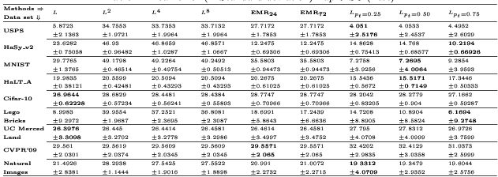
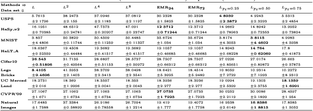
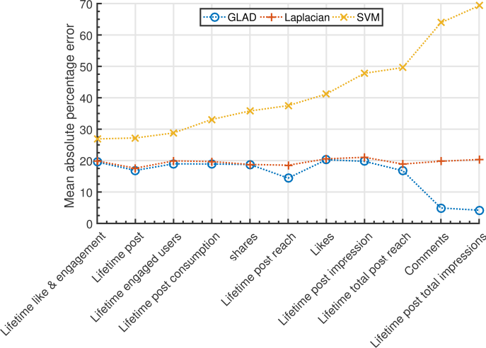
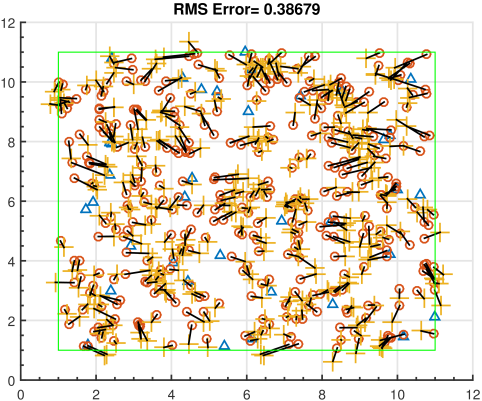
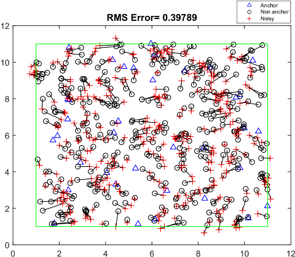
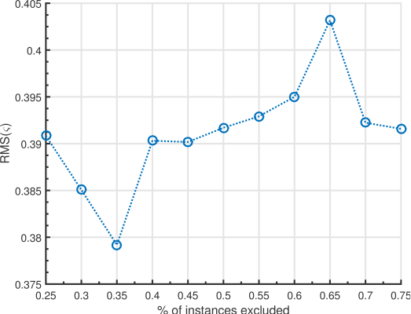
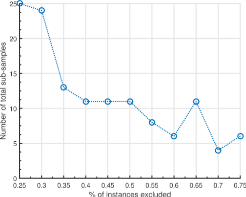

# GLAD
Graph Laplacian with Dropouts

## Requirements
1. Matlab > R2016a

## How to use?
1. Run **setup.m** to perform initial setup. 
1. Run **divRun_Lm.m** to obtain classifier's performance with base graph Laplacian (m>1 for iterated Laplacian). 
1. Run **divRun_pt.m** to obtain classifier's performance with GLAD (pt-threshold probability). 

## Results
<figure>
  <figcaption>Table: Mean error (± Standard deviation) LapRLSC (Test)</figcaption>
  
</figure> 
<figure>
  <figcaption>Table: Mean error (± Standard deviation) LapRLSC (Unlabeled)</figcaption>
  
</figure> 
<figure>
  
  <figcaption>Mean error on Facebook metrics</figcaption>
</figure> 
<figure>
  
  <figcaption>WSN localization using GLAD</figcaption>
</figure>
 
<figure>
  
  <figcaption>WSN localization using Iterative Laplacian with LPA</figcaption>
</figure>
 
<figure>
  
  <figcaption>Exclude percent vs RMSE (WSN)</figcaption>
</figure>
 
<figure>
  
  <figcaption>Exclude percent vs number of rounds (WSN)</figcaption>
</figure>
